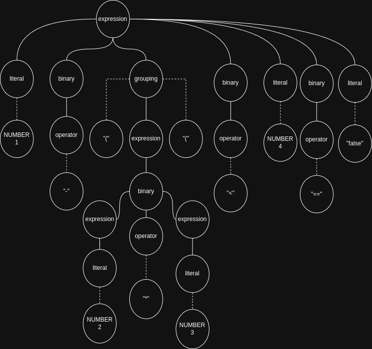

# CH5 note

## What is grammar?

> "used to specify the syntax of a language"

- Four components:
    a. From Dragon compilerls Principle Techniques and tools 2nd Edition
    1. A set of **terminal symbols**, sometimes referred to as **"tokens."** The termi-
    nals are the elementary symbols of the language defined by the grammar.
    2. A set of **nonterminals**, sometimes called **"syntactic variables."** Each non-
    terminal represents a set of strings of terminals 
    3. A set of **productions**, where each production consists of a nonterminal,
    called the *head* or *left side* of the production, an arrow, and a sequence of 
    terminals and/or nonterminals, called the *body* or *right side* of the produc-
    tion.  
    head -> body
    left side -> right side
    4. A designation of one of the nonterminals as the *start* symbol.
- Start symbol and repeatedly replacing a nonterminal by the body of production
- Ɛ is the  string of zero symbols from any alphabet (collection of symbols).
- Parse Tree
- lox example
    ```text
    breakfast  → protein "with" breakfast "on the side" ;
    breakfast  → protein ;
    breakfast  → bread ;

    protein    → crispiness "crispy" "bacon" ;
    protein    → "sausage" ;
    protein    → cooked "eggs" ;

    crispiness → "really" ;
    crispiness → "really" crispiness ;

    cooked     → "scrambled" ;
    cooked     → "poached" ;
    cooked     → "fried" ;

    bread      → "toast" ;
    bread      → "biscuits" ;
    bread      → "English muffin" ;
    ```
    to change to  
    ```text
    breakfast → protein ( "with" breakfast "on the side" )?
              | bread ;
    protein   → "really"+ "crispy" "bacon"
              | "sausage"
              | ( "scrambled" | "poached" | "fried" ) "eggs" ;
    bread     → "toast" | "biscuits" | "English muffin" ;
    ```
    - Terminals are quoted strings, and nonterminals are lowercase words.
    - * to allow the previous symbol or group to be repeated zero or more times.
    - + is similar, but requires the preceding production to appear at least once.
    - () parentheses for grouping and then allow |
         within that to select one from a series of options within the middle of a production.
    - ?  is for an optional production. The thing before it can appear zero or one time, but not more.

### Lox language first edition grammar

> 1 - (2 * 3) < 4 == false
```text
expression     → literal
               | unary
               | binary
               | grouping ;

literal        → NUMBER | STRING | "true" | "false" | "nil" ;
grouping       → "(" expression ")" ;
unary          → ( "-" | "!" ) expression ;
binary         → expression operator expression ;
operator       → "==" | "!=" | "<" | "<=" | ">" | ">="
               | "+"  | "-"  | "*" | "/" ;
```

- concern there is no epsilon for empty string, which i think should be inside expression
- like just empty 
> 

